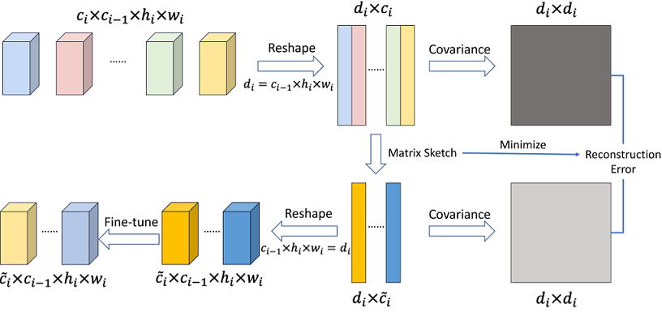

# Filter Sketch for Network Pruning ([Link](https://arxiv.org/abs/2001.08514))

Pruning neural network model via filter sketch.

<div align=center></div>

Framework of FilterSketch. The top displays the second-order covariance of the pre-trained CNN. The bottom shows the estimation of the second-order covariance for the pruned CNN. Our work preserves the covariance information in the pruned model, which is then effectively and efficiently solved by matrix sketch. 


## Tips

Any problem, free to contact the authors via emails: lmbxmu@stu.xmu.edu.cn or shaojieli@stu.xmu.edu.cn, or adding the first author's wechat as friends (id: lmbcxy if you are using wechat) for convenient communications. Do not post issues with github as much as possible, just in case that I could not receive the emails from github thus ignore the posted issues.


## Citation

If you find FilterSketch useful in your research, please consider citing:

```
@article{lin2020filter,
  title={Filter Sketch for Network Pruning},
  author={Lin, Mingbao and Ji, Rongrong and Li, Shaojie and Ye, Qixiang and Tian, Yonghong and Liu, Jianzhuang and Tian, Qi},
  journal={arXiv preprint arXiv:2001.08514},
  year={2020}
}
```


# Pre-trained Models

We provide the pre-trained models used in our paper.

## CIFAR-10

| [ResNet56](https://drive.google.com/open?id=1pt-LgK3kI_4ViXIQWuOP0qmmQa3p2qW5) | [ResNet110](https://drive.google.com/open?id=1Uqg8_J-q2hcsmYTAlRtknCSrkXDqYDMD) |[GoogLeNet](https://drive.google.com/open?id=1YNno621EuTQTVY2cElf8YEue9J4W5BEd) | 

## ImageNet

| [ResNet50](https://download.pytorch.org/models/resnet50-19c8e357.pth) |

# Result Models

We provide our pruned models in the experiments, along with their training loggers and configurations.

|           | DataSet  |              Sketch Rate              | Flops<br>(Prune Rate） | Params<br>(Prune Rate） | Top-1 Accuracy | Top-5 Accuracy |                           Download                           |
| :-------: | :------: | :-----------------------------------: | :--------------------: | :---------------------: | :------------: | :------------: | :----------------------------------------------------------: |
| ResNet56  | CIFAR-10 |               [0.6]*27                |     73.36M(41.5%)      |      0.50M(41.2%)       |     93.19%     |       -        | [Link](https://drive.google.com/open?id=1rp6MwwCzfnIcCUqqKCBKGCkfLMFxxKo2) |
| ResNet110 | CIFAR-10 | [0.9]\*3+[0.4]\*24+[0.3]\*24+[0.9]\*3 |     92.84M(63.3%)      |      0.69M(59.9%)       |     93.44%     |       -        | [Link](https://drive.google.com/open?id=1CrQ4P_5C__AAyAvXEllzMdxu9nE5rETO) |
| GoogLeNet | CIFAR-10 |               [0.25]*9                |      0.59B(61.1%)      |      2.61M(57.6%)       |     94.88%     |       -        | [Link](https://drive.google.com/open?id=1GwTuBqmMQr_5NYI0aF11JH57G4djTBB6) |
| ResNet50  | ImageNet |               [0.2]*16                |      0.93B(77.3%)      |      7.18M(71.8%)       |     69.43%     |     89.23%     | [Link](https://drive.google.com/open?id=148ul5qGuAi3hZWFdengVgik-7f_kb5hC) |
| ResNet50  | ImageNet |               [0.4]*16                |      1.51B(63.1%)      |      10.40M(59.2%)      |     73.04%     |     91.18%     | [Link](https://drive.google.com/open?id=1Hu8b7qxdTi_sY5RacudJQLkv2amQKbP9) |
| ResNet50  | ImageNet |               [0.6]*16                |      2.23B(45.5%)      |      14.53M(43.0%)      |     74.68%     |     92.17%     | [Link](https://drive.google.com/open?id=1UJWZlS49-aNfWOBaE6yD2SnXAnldSrew) |
| ResNet50  | ImageNet |               [0.7]*16                |      2.64B(35.5%)      |      16.95M(33.5%)      |     75.22%     |     92.41%     | [Link](https://drive.google.com/open?id=10PUjcbPwMkeJX2OTJSbwtxkWF5jLvKK1) |

# Running Code

The code has been tested using Pytorch1.3 and CUDA10.0 on Ubuntu16.04.


## Filter Sketch

You can run the following code to sketch model on Cifar-10:

```shell
python sketch_cifar.py 
--data_set cifar10 
--data_path ../data/cifar10/
--sketch_model ./experiment/pretrain/resne56.pt 
--job_dir ./experiment/resnet56/sketch/
--arch resnet 
--cfg resnet56 
--lr 0.01
--lr_decay_step 50 100
--num_epochs 150 
--gpus 0
--sketch_rate [0.6]*27
--weight_norm_method l2
```

You can run the following code to sketch model on Imagenet:

```shell
python sketch_imagenet.py 
--data_set imagenet 
--data_path ../data/imagenet/
--sketch_model ./experiment/pretrain/resne50.pth 
--job_dir ./experiment/resnet50/sketch/
--arch resnet 
--cfg resnet50 
--lr 0.1
--lr_decay_step 30 60
--num_epochs 90 
--gpus 0
--sketch_rate [0.6]*16
--weight_norm_method l2
```


## Test Our Performance

Follow the command below to verify our pruned models:

```shell
python test.py 
--data_set cifar10 
--data_path ../data/cifar10 
--arch resnet 
--cfg resnet56 
--sketch_model ./experiment/result/sketch_resnet56.pt 
--sketch_rate [0.6]*27 
--gpus 0
```


## Get FLOPS and Params

You can use the following command to install the thop python package when you need to calculate the flops of the model:

```shell
pip install thop
```

```shell
python get_flops_params.py 
--data_set cifar10 
--input_image_size 32 
--arch resnet 
--cfg resnet56
--sketch_rate [0.6]*27
```

## Remarks

The number of pruning rates required for different networks is as follows:

|           | CIFAR-10 | ImageNet |
| :-------: | :------: | :------: |
| ResNet56  |    27    |    -     |
| ResNet110 |    54    |    -     |
| GoogLeNet |    9     |    -     |
| ResNet50  |    -     |    16    |

## Other Arguments

```shell
optional arguments:
  -h, --help            show this help message and exit
  --gpus GPUS [GPUS ...]
                        Select gpu_id to use. default:[0]
  --data_set DATA_SET   Select dataset to train. default:cifar10
  --data_path DATA_PATH
                        The dictionary where the input is stored.
                        default:/home/lishaojie/data/cifar10/
  --job_dir JOB_DIR     The directory where the summaries will be stored.
                        default:./experiments
  --arch ARCH           Architecture of model. default:resnet
  --cfg CFG             Detail architecuture of model. default:resnet56
  --num_epochs NUM_EPOCHS
                        The num of epochs to train. default:150
  --train_batch_size TRAIN_BATCH_SIZE
                        Batch size for training. default:128
  --eval_batch_size EVAL_BATCH_SIZE
                        Batch size for validation. default:100
  --momentum MOMENTUM   Momentum for MomentumOptimizer. default:0.9
  --lr LR               Learning rate for train. default:1e-2
  --lr_decay_step LR_DECAY_STEP [LR_DECAY_STEP ...]
                        the iterval of learn rate. default:50, 100
  --weight_decay WEIGHT_DECAY
                        The weight decay of loss. default:5e-4
  --start_conv START_CONV
                        The index of Conv to start sketch, index starts from
                        0. default:1
  --sketch_rate SKETCH_RATE
                        The proportion of each layer reserved after sketching
                        convolution layer sketch. default:None
  --sketch_model SKETCH_MODEL
                        Path to the model wait for sketch. default:None
  --weight_norm_method WEIGHT_NORM_METHOD
                        Select the weight norm method. default:None
                        Optional:l2
```
